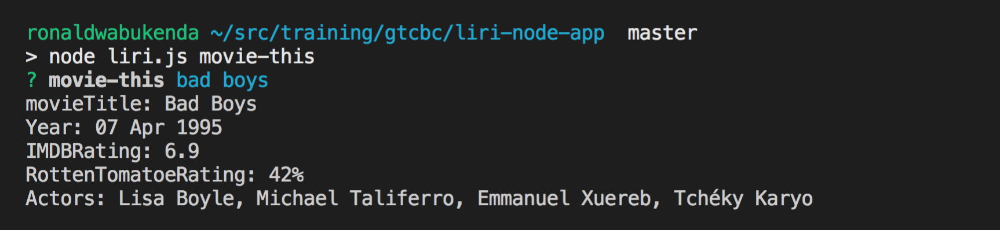
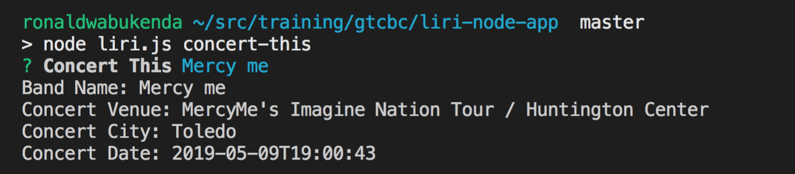
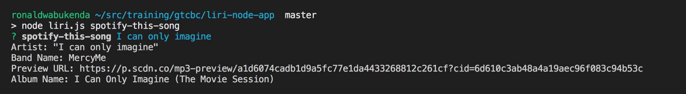

# Liri Node app

##  Setup
Below are a series of steps that the user has to follow to successfully setup the Liri-app
1. Download node from https://nodejs.org/en/download/ and install it on your computer.
2. While on the repo click the clone button.
3. Run git repo <repo-name>
4. Run npm install to get all the necessary npm packages.
5. Create a .env file. Add the following keys
   a. SPOTIFY_ID=<spotify id>
   b. SPOTIFY_SECRET=<spotify secret>
   c. OMDB_API_KEY= <omdb api key>
   d. BANDS_IN_TOWN_API_KEY =<band in town api key>
  
## Running the app

### OMDB
Within the terminal, 
1. Type the following command 
 >node liri.js movie-this <enter movie title> ex node movie-this RED . 
2. Click enter
3. The following info is returned in the console

      
4. If user does not enter a movie title, the default movie returned is  Mr.Nobody
  
      
      
### Bands in town
Within the terminal, 
1. Type the following command  node liri.js  concert-this <band_name> ex node liri.js  concert-this Maroon 5. Click enter.
2. The following info is returned in the console
  
     
        
###  Spotify App
Within the terminal, 
1. Type the following command  node liri.js spotify-this-song <song title> ex. node liri.js spotify-this-song stand by me
2. the following info is returned
    
     

### Do what it says
Within the terminal, 
1. Type the following command  node liri.js do-what-it-says 
2. Click enter.
The following info is returned

      
